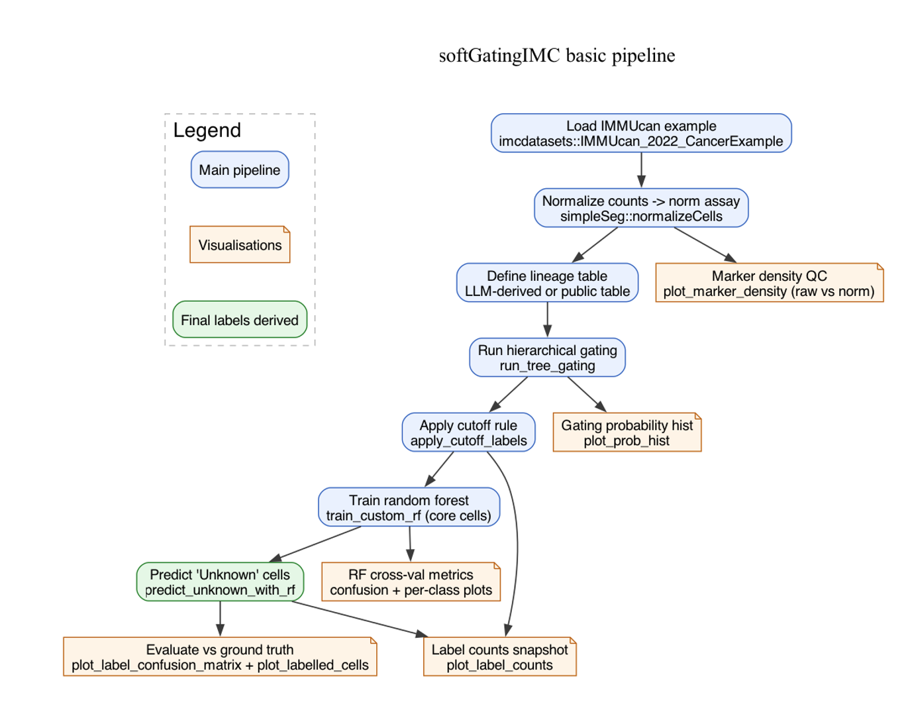

# Basic Pipeline Graph



# Getting Started

## Load in the cytoGateR

```{r}
# devtools::document()
# devtools::load_all()
# devtools::install() # for if you want the package on system
```

## Other Libraries

```{r}
suppressPackageStartupMessages({
  library(tidyverse)
  library(SpatialExperiment)
  library(ranger)
  library(imcdatasets)
  library(cytoGateR)
  library(simpleSeg)
  library(ggpubr)
  library(forcats)
})
```

## Load in Data

```{r load-data}
spe <- imcdatasets::IMMUcan_2022_CancerExample("spe")
```

## Normalise Assay

```{r normalise}
spe <- simpleSeg::normalizeCells(
  spe,
  assayIn = "counts",
  assayOut = "norm",
  imageID = "image_name",
  transformation = "asinh",
  method = c("trim99","minMax","PC1")
)
```

Check Normalisation:

::: panel-tabset
## Raw Counts

```{r raw-marker}
plot_marker_density(
  spe = spe,
  marker = "CD68",
  assay_name = "counts",
  image_col = "image_name",
  title = "before normalisation (raw count)"
)
```

## Transformed and Normalised

```{r normed-marker}
plot_marker_density(
  spe = spe,
  marker = "CD68",
  assay_name = "norm",
  image_col = "image_name",
  title = "Normalised Protein Marker CD68"
)
```
:::

## Lineage Table

### Extract markers

```{r extract-markers}
sort(row.names(spe))
```

### LLM Generates lineage table

In general we feed to the LLM a prompt like below. In this case, we **also** specify the cell types so we can make a comparison to public ground truth.

::: callout-note
# Prototype Prompt

Generate a lineage table in the format delimited by triple back ticks. Use domain knowledge to select cell types and positive and negative markers for each and based on these protein markers only `rownames(spe)`

```{r eval=FALSE}
lineage_table <- tribble( ~cell_type, ~pos_markers, ~neg_markers,

"T cell", list(c("CD4", "CD8", "CD3", "FOXP3", "PD1")), list(character(0)), "B cell", list(c("CD20")), list(character(0)), "Myeloid", list(c("CD68", "CD163", "CD14", "CD11b", "cd11c", "HLADR", "MPO")), list(character(0)), "Other immune", list(c("CD45")), list(character(0)),

"Vascular", list(c("CD31")), list(character(0)), "Stromal", list(c("aSMA", "FAP", "Vimentin", "CXCL12")), list(character(0)),

"Epithelial", list(c("Ecadherin", "CK7", "ER", "PR", "GATA3")), list(c("CD45")), "Tumor", list(c("CK5", "CK14", "EGFR", "Her2", "CAIX", "p63", "p53")), list(c("CD45")),

"Proliferating", list(c("KI67")), list(character(0)) )
```
:::

### Lineage Table

```{r lineage-tab}
lineage_table_public <- tribble(
  ~cell_type,     ~pos_markers,                                                    ~neg_markers,

  "Tumor",        list(c("CDH1", "CA9", "PD_L1")),                                 list(c("CD3e", "CD20", "SMA", "CD68")),
  "Stroma",       list(c("SMA", "PDGFRB")),                                        list(c("CDH1", "CD3e", "CD20", "MPO")),

  "Myeloid",      list(c("CD68", "CD163", "CD14", "CD11c", "CD33", "CD206", "CD303", "HLA_DR", "IDO1", "VISTA", "CD40")), list(c("CD3e", "CD20", "CDH1")),
  "Neutrophil",   list(c("MPO", "CD15", "CD16")),                                  list(c("CD3e", "CD20")),

  "Bcell",        list(c("CD20", "CD40", "HLA_DR", "B2M")),                        list(c("CD3e", "MPO", "CDH1")),
  "Plasma_cell",  list(c("CD38", "CD27")),                                         list(c("CD20", "CD3e", "CD4")),
  "BnTcell",      list(c("CD3e", "CD20", "CD7", "B2M")),                           list(c("CDH1", "SMA", "MPO")),

  "CD8",          list(c("CD3e", "CD8a", "GZMB", "TCF7")),                         list(c("CD4", "FOXP3", "CD20")),
  "CD4",          list(c("CD3e", "CD4")),                                          list(c("CD8a", "FOXP3", "CD20")),
  "Treg",         list(c("CD3e", "CD4", "FOXP3", "ICOS")),                         list(c("CD8a", "CD20"))
)
```

# Start Classifying

## Run Gating

```{r run-tree-gating}
res_pub <- cytoGateR::run_tree_gating(
  spe,
  lineage_table_public,
  assay_name = "exprs",
  max_depth = 11,
  min_cells = 200,
  min_score = 0.5,
  uncert_thresh = 0.25,
  neg_strength = 0.5
)
# res_pub <- cytoGateR::run_soft_gating(spe1, lineage_table_public) # for soft gating all downstream analysis should still run
```

## Visualise Cutoffs (98% threshold)

```{r}
plot_score_hist(res_pub)
```

## Apply Cutoff Rule

```{r apply-cutoff}
res_pub <- apply_cutoff_labels(res_pub,
                               label_col = "cutoff_label",
                               unknown_label = "Unknown")
plot_label_counts(spe = res_pub$spe,
                  label_col = "cutoff_label")
```

So we have a core group of cell identified at the top 2% which we will now train a random forest on.

## Train Random Forest

```{r train-rf}
rf_pub <- train_custom_randomforest(res_pub$spe,assay_name ="exprs",
                          label_col = "cutoff_label")
```


## Visualise RF Metrics from Cross Validation

::: panel-tabset
## Confusion Matrix

```{r conf-matrix-cv}
plot_confusion_matrix(rf_pub$metrics$confusion_matrix, title = "Public lineage: RF confusion")
```

## Class Metrics

```{r class-metrics}
class_metrics_pub <- class_metrics_from_fit(rf_pub)
plot_class_metrics(class_metrics_pub, title = "Public lineage: per-class metrics") + coord_flip(ylim = c(0.75, 1.1)) + theme_bw()
```
:::

## Apply Random Forest to the "Unknown" outside the core group of cells

```{r apply-rf}
rf_pub$spe <- predict_unknown_with_randomforest(rf_pub$spe,
                                       rf_pub$model,assay_name = "exprs",
                                       label_col = "cleaned_core_label",
                                       out_col = "cutoff_label_filled")

ggpubr::ggarrange(
  plotlist = list(
    plot_label_counts(spe = rf_pub$spe,
                  label_col = "cleaned_core_label",
                  title = "Before RF applied"),
    plot_label_counts(spe = rf_pub$spe,
                  label_col = "cutoff_label_filled",
                  title = "After RF applied")
    
  ),
  ncol =1
)
```

# Evaluation Against with Public Ground Truth (Extra)

## Clean public ground truth labels

```{r}
colData(rf_pub$spe)$cell_type_pub <- forcats::fct_recode(colData(rf_pub$spe)$cell_type, Unknown = "undefined")
colData(rf_pub$spe)$cell_labels_pub <- forcats::fct_recode(colData(rf_pub$spe)$cell_labels, NULL = "unlabeled")

# drop unknowns from cell_type
spe_pub_type <- rf_pub$spe[,colData(rf_pub$spe)$cell_type_pub != "Unknown"]
# colData(spe_pub_type)$cell_type_pub |> table()


# drop unlabelled from cell_labels
spe_pub_labels <- rf_pub$spe[,!is.na(colData(rf_pub$spe)$cell_labels_pub)]

```

## Confusion Matrices

```{r}
#| fig-width: 11
#| fig-height: 5
a <- plot_label_confusion_matrix(spe_pub_type,
                            label_col1 = "cutoff_label_filled",
                            label_col2 = "cell_type_pub",
                            title = "Against public ground truth classification",
                            subtitle = "n = 47794")
b <- plot_label_confusion_matrix(spe_pub_labels,
                            label_col1 = "cutoff_label_filled",
                            label_col2 = "cell_labels_pub",
                            title = "Against public ground truth manual labelling",
                            subtitle = "n = 13394")

ggpubr::ggarrange(plotlist = list(a,b))
```

## Spatial Evaluation 1st round

```{r}
all_labels <- unique(c(
  as.character(spe_pub_type$cutoff_label_filled),
  as.character(spe_pub_type$cell_type_pub)
))

my_colors <- as.vector(pals::polychrome(length(all_labels)))
names(my_colors) <- all_labels


ggpubr::ggarrange(
  plotlist = list(
    plot_labelled_cells(
      spe_pub_type,
      col_label = "cutoff_label_filled",
      image_index = 1:4,
      image_col = "image_name",
      point_size = 0.3,
      label_levels = all_labels,  # Forces the legend order to match
      label_colors = my_colors    # Forces the colors to match
    )+ theme(title = element_blank(), plot.subtitle = element_blank()),
    plot_labelled_cells(
      spe_pub_type,
      col_label = "cell_type",
      image_index = 1:4,
      image_col = "image_name",
      point_size = 0.3,
      label_levels = all_labels,
      label_colors = my_colors
    )
    + theme(title = element_blank(), plot.subtitle = element_blank())
  ),
  common.legend = TRUE,
  labels = c("cytoGateR", "Ground Truth classifier"),
  legend = "bottom",
  label.y = 1.02
)

```


## Train Random Forest 2nd round

```{r train-rf2}

rf_pub$spe$clusters_r1 <- as.character(rf_pub$spe$cutoff_label_filled)
rf_pub$spe$clusters_r1[rf_pub$spe$clusters_r1 == "Unassigned"] <- "Unknown"

rf_pub_2nd <- train_custom_randomforest(rf_pub$spe,
                                        label_col = "clusters_r1")
```


## Apply Random Forest to the "Unknown" outside the core group of cells 2nd round

```{r apply-rf2}
rf_pub_2nd$spe <- predict_unknown_with_randomforest(rf_pub_2nd$spe,
                                                    rf_pub_2nd$model,
                                                    label_col = "cleaned_core_label",
                                                    out_col = "cell_labels_2nd")

ggpubr::ggarrange(
  plotlist = list(
    plot_label_counts(spe = rf_pub_2nd$spe,
                  label_col = "cleaned_core_label",
                  title = "Before RF applied"),
    plot_label_counts(spe = rf_pub_2nd$spe,
                  label_col = "cell_labels_2nd",
                  title = "After RF applied")
    
  ),
  ncol =1
)
```


## Spatial Evaluation 2nd

```{r}
spe_pub_type <- rf_pub_2nd$spe[,colData(rf_pub_2nd$spe)$cell_type_pub != "Unknown"]
# colData(spe_pub_type)$cell_type_pub |> table()

# drop unlabelled from cell_labels
spe_pub_labels <- rf_pub_2nd$spe[,!is.na(colData(rf_pub_2nd$spe)$cell_labels_pub)]


all_labels <- unique(c(
  as.character(spe_pub_type$cell_labels_2nd),
  as.character(spe_pub_type$cell_type_pub)
))

my_colors <- as.vector(pals::polychrome(length(all_labels)))
names(my_colors) <- all_labels


ggpubr::ggarrange(
  plotlist = list(
    plot_labelled_cells(
      spe_pub_type,
      col_label = "cell_labels_2nd",
      image_index = 1:8,
      image_col = "image_name",
      point_size = 0.3,
      label_levels = all_labels,  # Forces the legend order to match
      label_colors = my_colors    # Forces the colors to match
    )+ theme(title = element_blank(), plot.subtitle = element_blank()),
    plot_labelled_cells(
      spe_pub_type,
      col_label = "cell_type_pub",
      image_index = 1:8,
      image_col = "image_name",
      point_size = 0.3,
      label_levels = all_labels,
      label_colors = my_colors
    )
    + theme(title = element_blank(), plot.subtitle = element_blank())
  ),
  common.legend = TRUE,
  labels = c("cytoGateR", "Ground Truth classifier"),
  legend = "bottom",
  label.y = 1.02
)

```


## Train Random Forest 3rd round

```{r train-rf3}

rf_pub_2nd$spe$clusters_r2 <- as.character(rf_pub_2nd$spe$cell_labels_2nd)
rf_pub_2nd$spe$clusters_r2[rf_pub_2nd$spe$clusters_r2 == "Unassigned"] <- "Unknown"

rf_pub_3rd <- train_custom_randomforest(rf_pub_2nd$spe,
                                        label_col = "clusters_r2")
```


## Apply Random Forest to the "Unknown" outside the core group of cells 2nd round

```{r apply-rf3}
rf_pub_3rd$spe <- predict_unknown_with_randomforest(rf_pub_3rd$spe,
                                                    rf_pub_3rd$model,
                                                    label_col = "cleaned_core_label",
                                                    out_col = "cell_labels_3rd")

ggpubr::ggarrange(
  plotlist = list(
    plot_label_counts(spe = rf_pub_3rd$spe,
                  label_col = "cleaned_core_label",
                  title = "Before RF applied"),
    plot_label_counts(spe = rf_pub_3rd$spe,
                  label_col = "cell_labels_3rd",
                  title = "After RF applied")
    
  ),
  ncol =1
)
```


## Spatial Evaluation 3rd

```{r}
spe_pub_type <- rf_pub_3rd$spe[,colData(rf_pub_3rd$spe)$cell_type_pub != "Unknown"]
# colData(spe_pub_type)$cell_type_pub |> table()

# drop unlabelled from cell_labels
spe_pub_labels <- rf_pub_3rd$spe[,!is.na(colData(rf_pub_3rd$spe)$cell_labels_pub)]


all_labels <- unique(c(
  as.character(spe_pub_type$cell_labels_3rd),
  as.character(spe_pub_type$cell_type_pub)
))

my_colors <- as.vector(pals::polychrome(length(all_labels)))
names(my_colors) <- all_labels


ggpubr::ggarrange(
  plotlist = list(
    plot_labelled_cells(
      spe_pub_type,
      col_label = "cell_labels_3rd",
      image_index = 1:8,
      image_col = "image_name",
      point_size = 0.3,
      label_levels = all_labels,  # Forces the legend order to match
      label_colors = my_colors    # Forces the colors to match
    )+ theme(title = element_blank(), plot.subtitle = element_blank()),
    plot_labelled_cells(
      spe_pub_type,
      col_label = "cell_type_pub",
      image_index = 1:8,
      image_col = "image_name",
      point_size = 0.3,
      label_levels = all_labels,
      label_colors = my_colors
    )
    + theme(title = element_blank(), plot.subtitle = element_blank())
  ),
  common.legend = TRUE,
  labels = c("cytoGateR", "Ground Truth classifier"),
  legend = "bottom",
  label.y = 1.02
)

```


